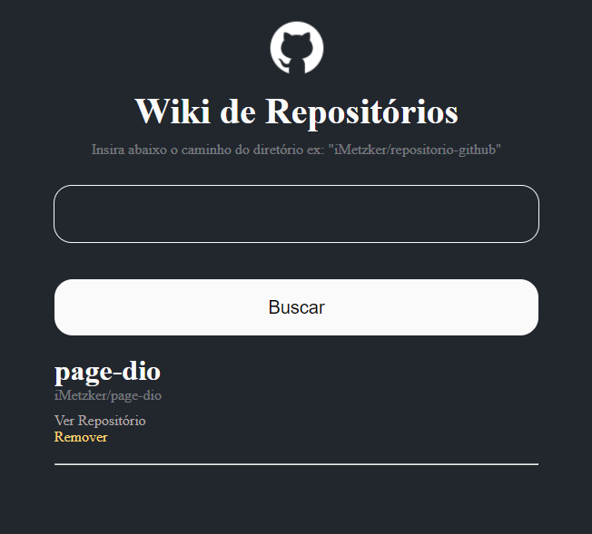

# Wiki de Repositório

Status: Finish

## 📎 Sobre

O projeto proposto durante o ⭐ Bootcamp Orange Tech + ⭐ consiste na criação de uma Wiki para salvar repositórios consumindo a API do GitHub.

## 🛸 Tecnologias Utilizadas

 
  
  
  
  
  

## 🛠 Prévia 

  
