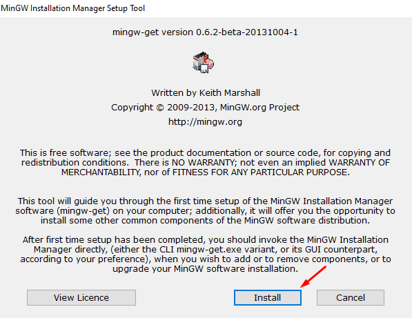

  <a href="#configuração-de-ambiente-no-windows">Configurações de Ambiente</a>&nbsp;&nbsp;&nbsp;|&nbsp;&nbsp;&nbsp;
  <a href="#resoluções-dos-exercícios">Respostas dos Exercícios</a>

   

# Repositório Acadêmico

## Algoritmo e Estrutura de Dados I
Este repositório é apenas para resoluções dos exercícios avaliativos propostos durante o período letivo.

> Faculdade Presidente Antonio Carlos - AlfaUnipac  
Graduação de nível superior em Sistemas de Informação  
Grade do 2º período 
Docente Maria Laura

## Configuração de Ambiente no Windows
Configurações iniciais para a compilação de códigos na linguagem C utilizando a IDE do VsCode.  

Para executar programas em C no VSCode, precisamos de um arquivo que vem junto com a instalação do DEVC++, este arquivo é o Mingw, faça o download e instalação dele. 
 
1. Faça o download do MinGW:
 

  

 
2. Faça a instalação, seguindo os passos abaixo:
 

 

 
3. Nesta última tela, marque o pacote básico do MinGW, vá no canto superior da tela, selecione ``instalation`` e ``apply changes``:
 

Após a instalação, iremos ter acesso ao executável gcc, que será o responsável pela compilação dos nossos códigos em C, este executável deve ser acessível em todo o nosso sistema, para isso:
 
1. Clique na barra de iniciar do Windows, digite 'variaveis de ambiente' e vá para as propriedades: 

 

 

2. Localize o Path dentro das variáveis do sistema, e clique em ``Editar``:

3. Clique em ``Procurar`` e entre na pasta bin do MinGw, para salvar o diretório dessa nova variável que será utilizada, que é o gcc. Após isso, clique me ``Ok`` e feche a aba:
 

## | Configurações do VSCode

1. Para execução dos programas em C no VSCode, adicione duas novas extensões: 
 

2. Configure o VSCode a executar corretamente o gcc, atualizando o caminho utilizado no Terminal Integrated, que por default estará null. 

- Abra seu VSCode e vá nas configurações ``CTRL`` + ``,`` e digite na barra de pesquisa ``shell`` , localize o ``Terminal Integrated Default`` e mude para que execute no próprio promt do windows.

 

 

Após seguir esses passos basta reiniciar o ambiente de desenvolvimento e seu VSCode já estará <b>pronto para compilar códigos em C utilizando a tecla F6.</b>

## Resoluções dos Exercícios
<table>
    <tr>
        <th>Lista de Exercícios - 01</th>
        <th>Lista de Exercícios - 02</th>
    </tr>
    <tr>
        <td><a href="./lista_01/questao_01.c">Questão 01</a></td>
        <td><a href="./lista_02/questao_01.c">Questão 01</a></td>
    </tr>
    <tr>
        <td><a href="./lista_01/questao_02.c">Questão 02</a></td>
        <td><a href="./lista_02/questao_02.c">Questão 02</a></td>
    </tr>
    <tr>
        <td><a href="./lista_01/questao_03.c">Questão 03</a></td>
        <td><a href="./lista_02/questao_03.c">Questão 03</a></td>
    </tr>
    <tr>
        <td><a href="./lista_01/questao_04.c">Questão 04</a></td>
        <td><a href="./lista_02/questao_04.c">Questão 04</a></td>
    </tr>
    <tr>
        <td><a href="./lista_01/questao_05.c">Questão 05</a></td>
        <td>-</td>
    </tr>
    <tr>
        <td><a href="./lista_01/questao_06.c">Questão 06</a></td>
        <td>-</td>
    </tr>
    
</table>

