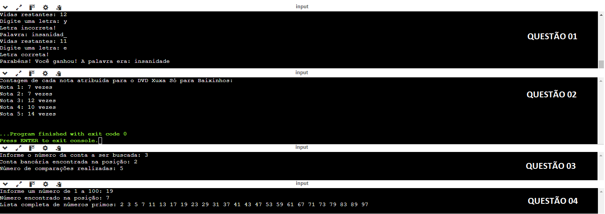

## Algoritmo e Estrutura de Dados I

Lista de exercícios 02 - Aprofundando em laços de repetição com while e for, busca linear e busca binária.

> <b>Busca Linear:</b> Utilizada para encontrar um elemento em uma lista verificando cada item sequencialmente até encontrar o item desejado ou chegar ao fim da lista.
   
> <b>Busca Binária:</b> Também utilizada para encontrar um elemento em uma lista, porém esta lista precisa ser ordenada, ela funciona ao dividir repetidamente a lista pela metade, comparando o elemento do meio com o valor desejado, descartando metade dos elementos a cada passo.

## Resoluções dos Exercícios
<table>
    <tr>
        <th>Lista de Exercícios - 02</th>
        <th>Descrição da Atividade</th>
    </tr>
    <tr>
        <td><a href="./questao_01.c">Questão 01</a></td>
        <td>Jogo da Forca (busca linear)</td>
    </tr>
    <tr>
        <td><a href="./questao_02.c">Questão 02</a></td>
        <td>Lista Randômica (busca linear)</td>
    </tr>
    <tr>
        <td><a href="./questao_03.c">Questão 03</a></td>
        <td>Lista de Contas (busca binária)</td>
    </tr>
    <tr>
        <td><a href="./questao_04.c">Questão 04</a></td>
        <td>Números Primos (busca binária)</td>
    </tr>
</table>

## 💻 Preview

