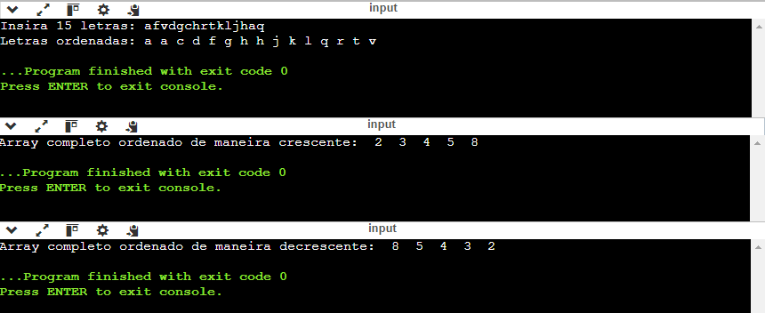

## Algoritmo e Estrutura de Dados I

Lista de exercícios 03 - Aprofundando em algoritmos de ordenação Bubble Sort.

> <b>Ordenação Bubble Sort:</b> "Se trata de um algoritmo de ordenação simples que funciona repetidamente trocando pares de elementos adjacentes se eles estiverem na ordem incorreta, o processo continua até que todos os elementos estejam na ordem correta.  O nome "bubble" (bolha) vem do fato de que, durante o processo de ordenação, os maiores elementos "flutuam" para o topo (final da lista) à medida que as comparações são feitas."
   

## Resoluções dos Exercícios
<table>
    <tr>
        <th>Lista de Exercícios - 02</th>
        <th>Descrição da Atividade</th>
    </tr>
    <tr>
        <td><a href="./questao_01.c">Questão 01</a></td>
        <td>Ordenação Alfabética</td>
    </tr>
    <tr>
        <td><a href="./questao_02.c">Questão 02</a></td>
        <td>Ordenação Numérica Crescente + Otimização</td>
    </tr>
    <tr>
        <td><a href="./questao_03.c">Questão 03</a></td>
        <td>Alteração Para Ordenação Numérica Decrescente</td>
    </tr>
</table>

## 💻 Preview

