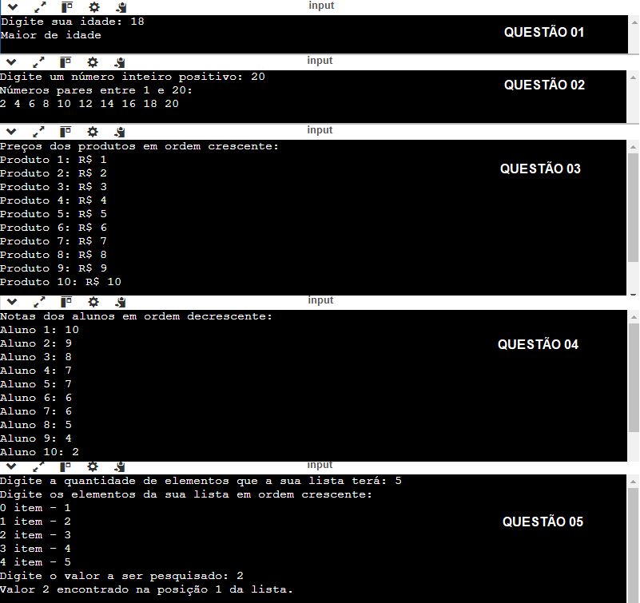

## Algoritmo e Estrutura de Dados I

Lista de exercícios 04 - Métodos de  Ordenção + Busca Binária + Estrutura de Repetição

> <b>Ordenação Selection Sort:</b> "Este algoritmo ordena uma lista repetidamente selecionando o menor (ou maior) elemento da parte não ordenada e o colocando na sua posição correta na parte ordenada."
   
> <b>Ordenação Insertion Sort:</b> "O Insertion Sort é um algoritmo simples de ordenação que funciona de maneira semelhante a como se organiza cartas de baralho em suas mãos. Ele percorre a lista e vai inserindo cada elemento na posição correta, em relação aos elementos que já foram ordenados."
   

## Resoluções dos Exercícios
<table>
    <tr>
        <th>Lista de Exercícios - 04</th>
        <th>Descrição da Atividade</th>
    </tr>
    <tr>
        <td><a href="./questao_01.c">Questão 01</a></td>
        <td>Switch Case</td>
    </tr>
    <tr>
        <td><a href="./questao_02.c">Questão 02</a></td>
        <td>Números Pares</td>
    </tr>
    <tr>
        <td><a href="./questao_03.c">Questão 03</a></td>
        <td>Ordenação Insertion Sort</td>
    </tr>
    <tr>
        <td><a href="./questao_04.c">Questão 04</a></td>
        <td>Ordenação Selection Sort</td>
    </tr>
    <tr>
        <td><a href="./questao_05.c">Questão 05</a></td>
        <td>Busca Binária</td>
    </tr>
</table>

## 💻 Preview

