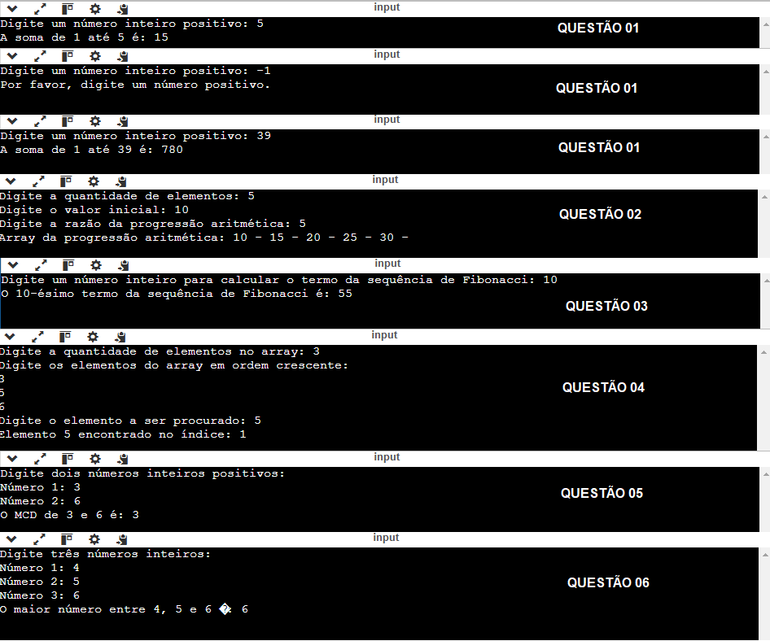

## Algoritmo e Estrutura de Dados I

Lista de exercícios 05 - Funções Recursivas

## Resoluções dos Exercícios
<table>
    <tr>
        <th>Lista de Exercícios - 05</th>
        <th>Descrição da Atividade</th>
    </tr>
    <tr>
        <td><a href="./questao_01.c">Questão 01</a></td>
        <td>Soma recursiva</td>
    </tr>
    <tr>
        <td><a href="./questao_02.c">Questão 02</a></td>
        <td>Array com razão de progressão aritmética</td>
    </tr>
    <tr>
        <td><a href="./questao_03.c">Questão 03</a></td>
        <td>Fibonacci</td>
    </tr>
    <tr>
        <td><a href="./questao_04.c">Questão 04</a></td>
        <td>Busca binária e recursividade</td>
    </tr>
    <tr>
        <td><a href="./questao_05.c">Questão 05</a></td>
        <td>MCD</td>
    </tr>
    <tr>
        <td><a href="./questao_06.c">Questão 06</a></td>
        <td>Maior de 3 números</td>
    </tr>
</table>

## 💻 Preview

