

  <a href="#-configurações">Configurações de Ambiente</a>&nbsp;&nbsp;&nbsp;|&nbsp;&nbsp;&nbsp;
  <a href="#-resoluções">Resoluções dos Exercícios</a>

   

# Repositório Acadêmico

## Algoritmo e Estrutura de Dados I
Este repositório é apenas para resoluções dos exercícios avaliativos propostos durante o período letivo.

> Faculdade Presidente Antonio Carlos - AlfaUnipac  
Graduação de nível superior em Sistemas de Informação  
Grade do 2º período 
Docente Maria Laura

## Configuração de Ambiente no Windows
Configurações iniciais para a compilação de códigos na linguagem C utilizando a IDE do VsCode.  

#### | Simulando o DEVC++
Para executar programas em C no VSCode, precisamos de um arquivo que vem junto com a instalação do DEVC++, este arquivo é o Mingw, faça o download e instalação dele. 
   
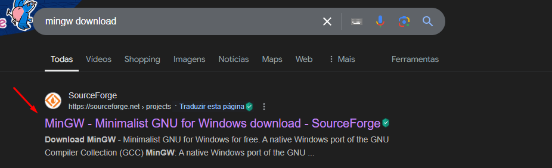
   
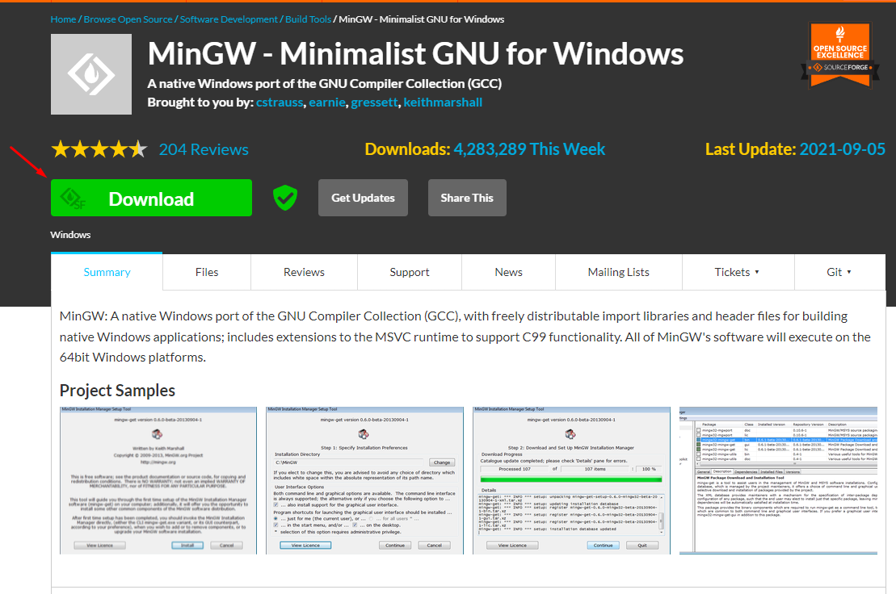
   
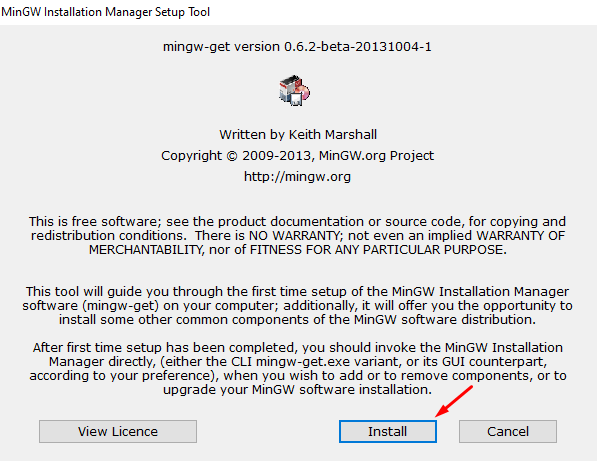
   
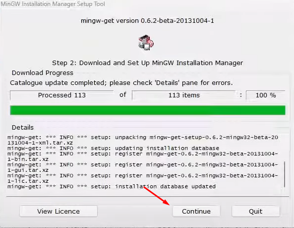
   
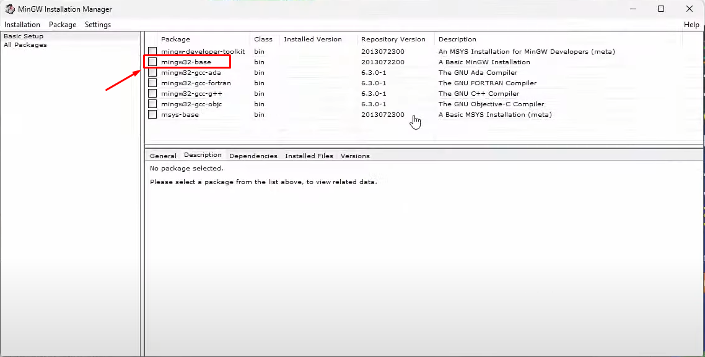

Após a instalação, iremos ter acesso ao executável gcc, que será o responsável pela compilação dos nossos códigos em C, este executável deve ser acessível em todo o nosso sistema, para isso:
 
1. Clique na barra de iniciar do Windows, digite 'variaveis de ambiente' e vá para as propriedades: 

 
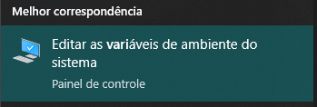
   
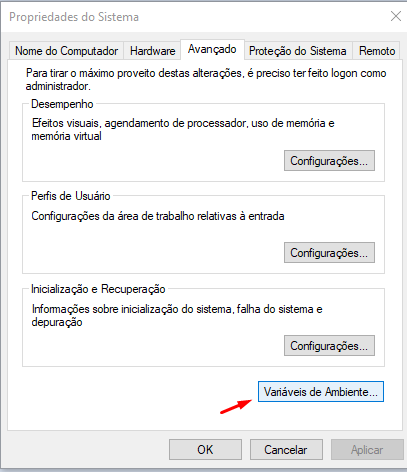
   

2. Localize o Path dentro das variáveis do sistema, e clique em ``Editar``:
   
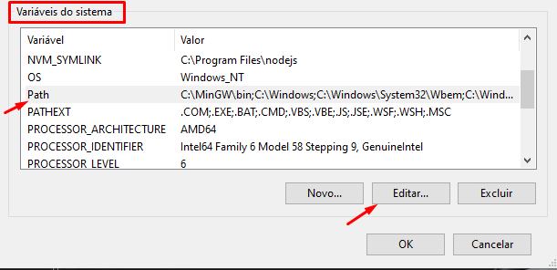
   

3. Clique em ``Procurar`` e entre na pasta bin do MinGw, para salvar o diretório dessa nova variável que será utilizada, que é o gcc. Após isso, clique me ``Ok`` e feche a aba:
   
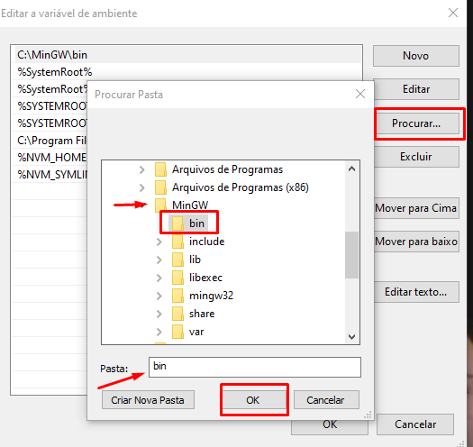

### | Configurações do VSCode

Para execução dos programas em C no VSCode, adicione duas novas extensões: 
   
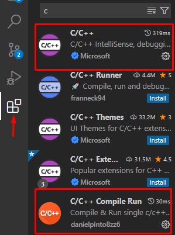

Para configurar o VSCode a executar corretamente o gcc, atualize o caminho utilizado no Terminal Integrated, que por default estará null. 

- Abra seu VSCode e vá nas configurações ``CTRL`` + ``,`` e digite na barra de pesquisa ``shell`` , localize o ``Terminal Integrated Default`` e mude para que execute no próprio promt do windows.

 
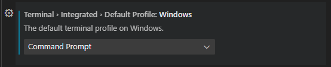
   

Após seguir esses passos basta reiniciar o ambiente de desenvolvimento e seu VSCode já estará <b>pronto para compilar códigos em C utilizando a tecla F6.</b>

## Resoluções dos Exercícios
<table>
    <tr>
        <th>Lista de Exercícios - 01</th>
    </tr>
    <tr>
        <td><a href="./lista_01/questao_01.c">Questão 01</a></td>
    </tr>
    <tr>
        <td><a href="./lista_01/questao_02.c">Questão 02</a></td>
    </tr>
    <tr>
        <td><a href="./lista_01/questao_03.c">Questão 03</a></td>
    </tr>
    <tr>
        <td><a href="./lista_01/questao_04.c">Questão 04</a></td>
    </tr>
    <tr>
        <td><a href="./lista_01/questao_05.c">Questão 05</a></td>
    </tr>
    <tr>
        <td><a href="./lista_01/questao_06.c">Questão 06</a></td>
    </tr>
    
</table>

