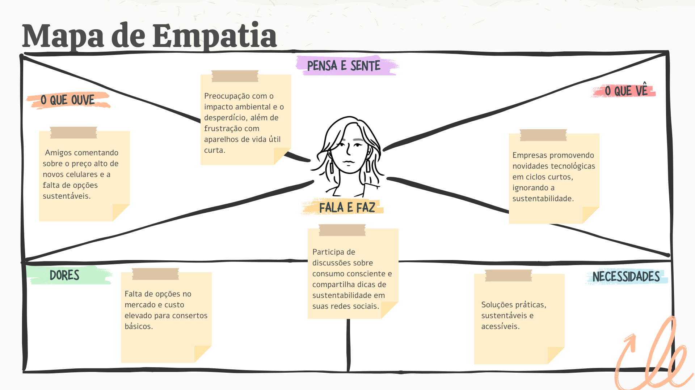
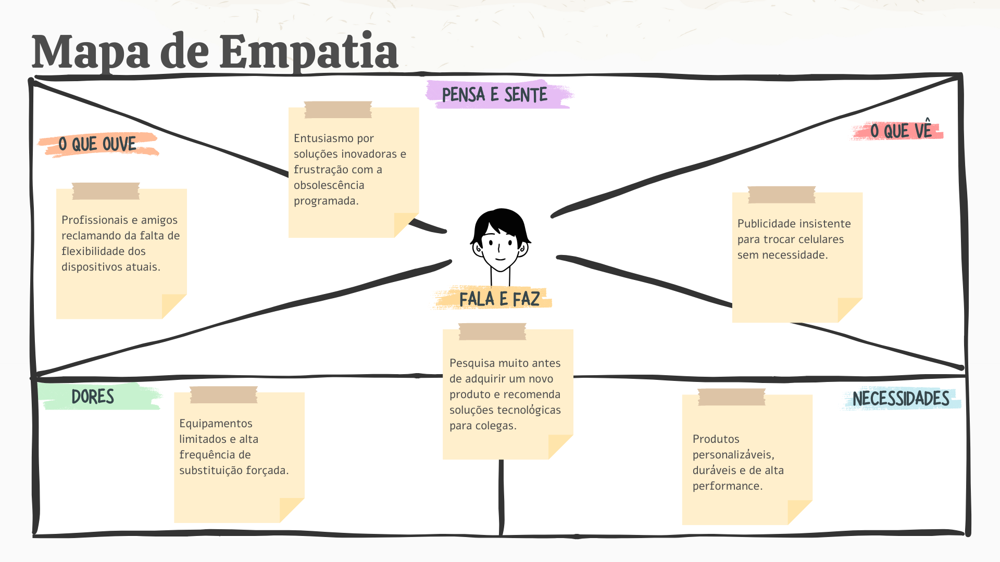

# Upgrades Acessíveis em Dispositivos Móveis

### Cenário: Startup ImbraTech - Tecnologia Sustentável e Escalável

A indústria de smartphones adota um modelo baseado na obsolescência programada, com dispositivos projetados para se tornarem obsoletos rapidamente devido à falta de atualizações, degradação de componentes e design não modular. Isso leva ao descarte frequente de aparelhos, gerando lixo eletrônico massivo e barreiras de acessibilidade devido ao alto custo de novos dispositivos.
   
A ImbraTech, uma startup de soluções sustentáveis, propõe dispositivos móveis modulares e acessíveis, permitindo a substituição e upgrades de componentes como baterias, câmeras e processadores. Essa abordagem prolonga a vida útil dos aparelhos, reduz o impacto ambiental e promove a inclusão tecnológica.

### Problema Macro Identificado: Obsolescência Programada e Geração de Lixo Eletrônico

A obsolescência programada nos celulares agrava o lixo eletrônico, incentivando o descarte de dispositivos que poderiam ser reparados. Além disso, o design fechado e a falta de componentes modulares frustram usuários, impedindo reparos e upgrades simples, como trocar baterias ou atualizar câmeras e processadores. Essa limitação reforça o ciclo de consumo descartável, dificultando a personalização e a extensão da vida útil dos aparelhos.

### Personas

### Matriz de Brainstorm

<table>
    <tr>
        <th>Problema Macro</th>
        <th>Dores e Necessidades</th>
        <th>Ideias e Soluções</th>
        <th>Prioridade</th>
    </tr>
    <tr>
        <td>Obsolescência programada encurtando a vida útil dos celulares</td>
        <td>Usuários são forçados a substituir celulares por falhas pequenas em vez de repará-los, gerando frustração e custos</td>
        <td>- Criar celulares modulares com componentes substituíveis.   - Incentivar a produção de peças de reposição acessíveis
        </td>
        <td> Alta
        </td>
    </tr>
    <tr>
        <td>Crescimento do lixo eletrônico e seus impactos ambientais</td>
        <td>O descarte inadequado dos celulares contribui para a poluição do meio ambiente e a exploração excessiva de recursos</td>
        <td>- Advertir e criar campanhas de conscientização ambiental no marketing dos nossos dispositivos</td>
        <td>Alta</td>
    </tr>
    <tr>
        <td>Falta de indústrias parceiras para fornecimento de tecnologias modulares e sustentáveis</td>
        <td>Consumidores encontram poucas opções no mercado de dispositivos projetados para reparabilidade, sustentabilidade e upgrades modulares.</td>
        <td>- Buscar fabricantes parceiros</td>
        <td>Alta</td>
    </tr>
    <tr>
        <td>Preocupações com a durabilidade e qualidade dos componentes modulares</td>
        <td>Os consumidores podem ter receio de que os componentes modulares não sejam tão duráveis ou de alta qualidade quanto os dispositivos tradicionais</td>
        <td>- Garantia de a alta qualidade e durabilidade dos componentes modulares com certificações de qualidade rigorosas   - Oferecer garantias de longo prazo para aumentar a confiança do consumidor</td>
        <td>Média</td>
    </tr>
    <tr>
        <td>Preocupação com a performace dos celulares modulares em comparação com os convencionais</td>
        <td>Alguns consumidores podem temer que a performance dos dispositivos modulares seja inferior à dos celulares convencionais devido às trocas de componentes</td>
        <td>- Buscar parcerias com fornecedores de componentes de topo de linha, como fabricantes de chips de processadores, memória, câmeras e baterias</td>
        <td>Alta</td>
    </tr>
    <tr>
        <td>Falta de confiança no modelo modular para longos períodos de uso</td>
        <td>Consumidores podem desconfiar de um dispositivo modular como uma solução duradoura</td>
        <td>- Criar garantias estendidas e planos de manutenção para dispositivos modulares  
- Oferecer suporte contínuo e peças de reposição</td>
        <td>Baixa</td>
    </tr>
</table>
 

## Integrantes do Grupo
> Arthur A. Santos  
Bruno Henrique Santos  
Ivny X.Metzker  
Maverson S. Santos  
Renato Junio P. Moura