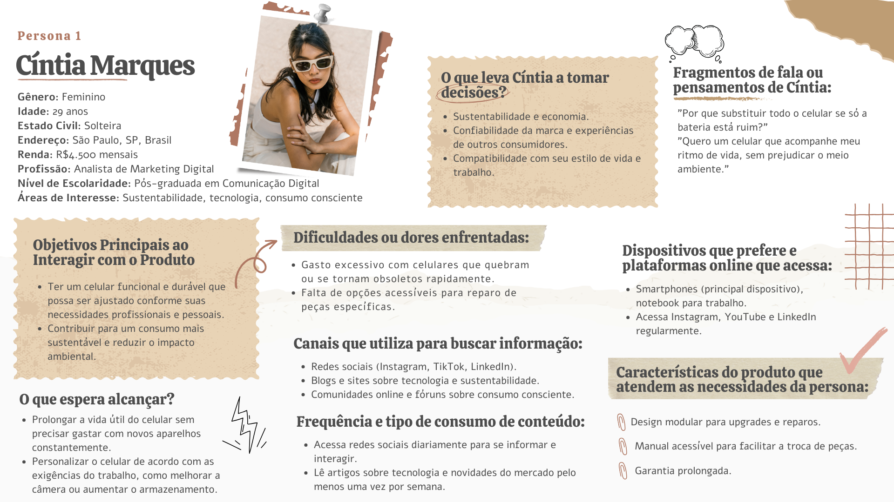

# Upgrades Acessíveis em Dispositivos Móveis

#### Cenário: Impacto Ambiental da Obsolescência Programada em Celulares
O mercado global de smartphones é marcado por ciclos curtos de atualização e substituição, impulsionados pela obsolescência programada. Os celulares são frequentemente projetados para serem substituídos em vez de reparados, com componentes difíceis de trocar ou reparar, como baterias, câmeras e processadores. Essa prática, incentivada por grandes empresas, encurta a vida útil dos dispositivos e gera lucros crescentes para os fabricantes. No entanto, essa abordagem tem um custo ambiental significativo: o aumento do lixo eletrônico. Esse tipo de resíduo é uma das maiores e mais rapidamente crescentes fontes de lixo tóxico, que, quando não descartado de forma adequada, contamina o meio ambiente e representa uma ameaça crescente à saúde pública e à sustentabilidade global.

## Problema Macro Identificado

A obsolescência programada nos celulares, promovida como estratégia de mercado, agrava a crise do lixo eletrônico. Os dispositivos são descartados em grande quantidade, mesmo quando pequenas falhas poderiam ser resolvidas por meio de reparos. Esse modelo contribui para o desperdício de recursos naturais, o aumento da poluição ambiental e a insatisfação de consumidores mais conscientes sobre sustentabilidade.

## Solução Proposta:
Desenvolver celulares modulares que priorizem a reparabilidade e a personalização. Com componentes intercambiáveis, como baterias, câmeras e processadores, os usuários poderiam substituir ou atualizar apenas as partes necessárias, estendendo significativamente a vida útil do dispositivo. Essa abordagem atende ao interesse crescente por produtos sustentáveis e adaptáveis, ao mesmo tempo que oferece aos consumidores maior controle sobre seus dispositivos. Além disso, reduziria a geração de lixo eletrônico, alinhando-se a práticas de economia circular e incentivando uma relação mais responsável entre fabricantes, consumidores e o meio ambiente.

### Personas

### Matriz de Brainstorm

<table>
    <tr>
        <th>Problema Macro</th>
        <th>Dores e Necessidades</th>
        <th>Ideias e Soluções</th>
        <th>Prioridade</th>
    </tr>
    <tr>
        <td>Obsolescência programada encurtando a vida útil dos celulares.</td>
        <td>Usuários são forçados a substituir celulares por falhas pequenas em vez de repará-los, gerando frustração e custos.</td>
        <td>- Criar celulares modulares com componentes substituíveis.   - Incentivar a produção de peças de reposição acessíveis.
        </td>
        <td> Alta
        </td>
    </tr>
    <tr>
        <td>Crescimento do lixo eletrônico e seus impactos ambientais.</td>
        <td>O descarte inadequado dos celulares contribui para a poluição do meio ambiente e a exploração excessiva de recursos.</td>
        <td>- Implantar programas de reciclagem obrigatória para fabricantes.  
- Criar campanhas de conscientização ambiental.</td>
        <td>Alta</td>
    </tr>
    <tr>
        <td>Falta de incentivo para práticas sustentáveis no setor.</td>
        <td>Consumidores encontram poucas opções no mercado de dispositivos projetados para durabilidade e sustentabilidade.</td>
        <td>- Oferecer benefícios fiscais a fabricantes que desenvolvam produtos ecológicos. 
- Regulamentar práticas de design sustentável.</td>
        <td>Média</td>
    </tr>
    
</table>